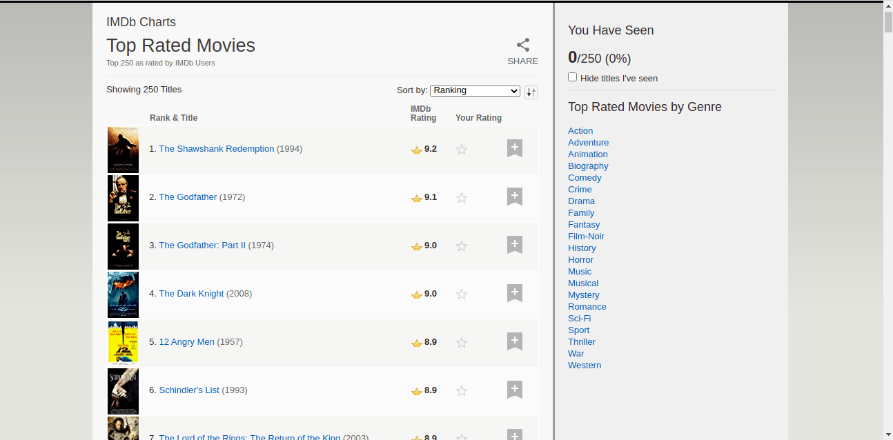
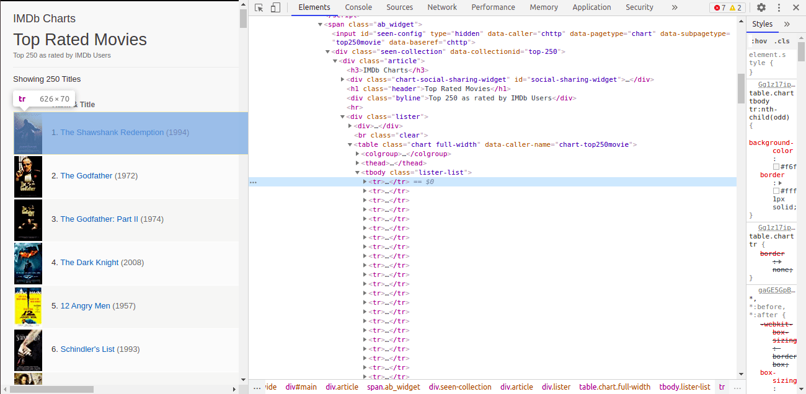

# Scraping IMDB Movie Website

## Top rated movies list

Scraped Website URL = https://www.imdb.com/chart/top/

  

From IMDB top rated movies website we going to scrap the 250 ranking, movie names, released year, and rating. Also we save them into a excel sheet.

  

Reference:
- Youtube